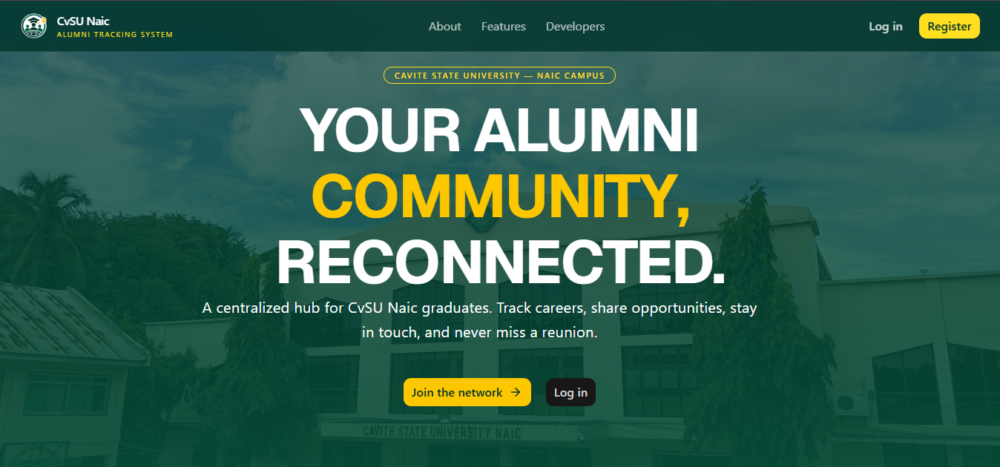

# CvSU Naic — Online Alumni Tracking System

A full-stack web application for **Cavite State University — Naic Campus** that connects graduates with their alma mater, tracks career progress, facilitates networking, and manages alumni events and opportunities.

Built by BSIT students as a final project.

---

## Tech Stack

| Layer | Technology |
|-------|-----------|
| **Framework** | React 19 + TypeScript |
| **Build Tool** | Vite 8 |
| **Routing** | TanStack Router (file-based) |
| **Styling** | Tailwind CSS 4 + shadcn/ui |
| **Backend** | Supabase (PostgreSQL, Auth, Storage, Edge Functions) |
| **Charts** | Recharts |
| **Deployment** | Vercel |

---

## Features

### Public
- Landing page with hero, about, features, team profiles
- Sign up / Sign in with Supabase Auth
- Password reset flow

### Alumni
- **Dashboard** — profile completion tracker, announcements, upcoming events, recent jobs
- **Profile Management** — editable personal info, social links, avatar, resume & certificate uploads
- **Employment Tracking** — employment status, career history timeline
- **Events** — browse, RSVP, view attendees, filter by course
- **Job Referral Board** — browse approved jobs, post opportunities, track submissions
- **Alumni Directory** — search and filter alumni by name, course, batch, location
- **Notifications** — in-app inbox with read/unread tracking
- **Settings** — account, security, notification preferences

### Admin
- **Dashboard** — KPIs, registration trends, batch distribution, employment stats, recent activity
- **Alumni Management** — view all profiles, verify/reject verification status
- **User Management** — edit roles, batch, course; delete users
- **Event Management** — create events with course targeting, RSVP tracking
- **Job Post Management** — approve/reject job submissions
- **Employment Analytics** — industry distribution, top employers

## Deployment

The app is configured for **Vercel** deployment — the `vercel.json` rewrites all routes to `index.html` for SPA routing.

---

## Developers

- **Patricia Ann C. Mahinay** — Lead Developer
- **Faith Tomelden** — UI/UX Designer
- **Sanny Gine V. Patan-Patan** — Backend Developer
- **Cristene C. Rios** — Document Specialist

**Cavite State University — Naic Campus**
